# 🎨 **Mermaid Diagrams for Each Slide Section**

---

# **Slide 3 — The Macro Shift**
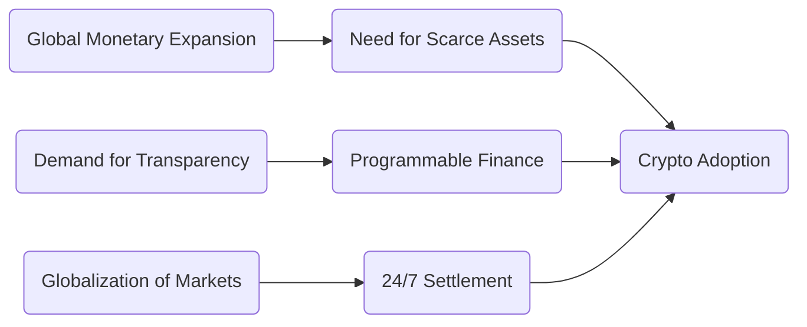

---

# **Slide 4 — Trustless Technology**
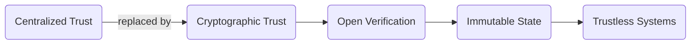

---

# **Slide 5 — Bitcoin: Digital Gold**
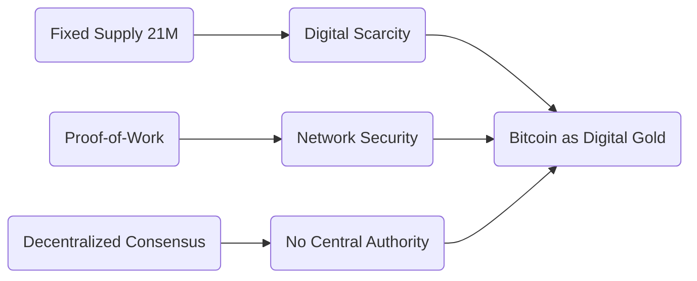

---

# **Slide 6 — Bitcoin Mechanics**
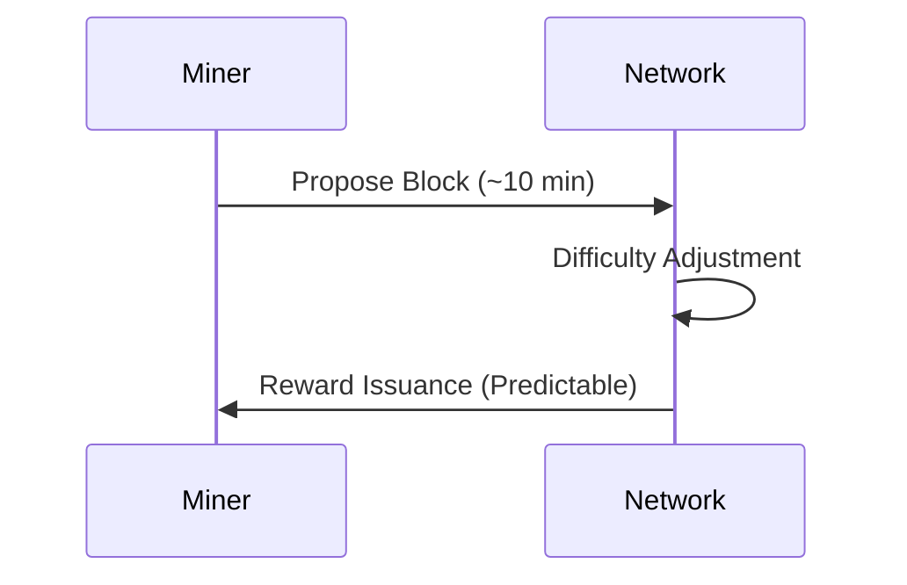

---

# **Slide 7 — Ethereum Settlement Layer**
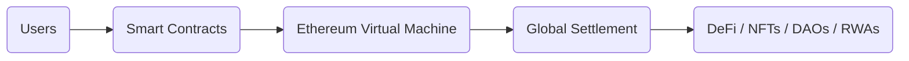

---

# **Slide 8 — Smart Contracts**
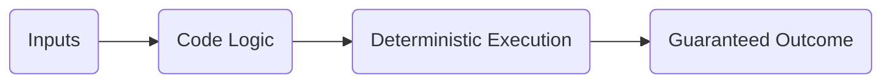

---

# **Slide 9 — DeFi Landscape**
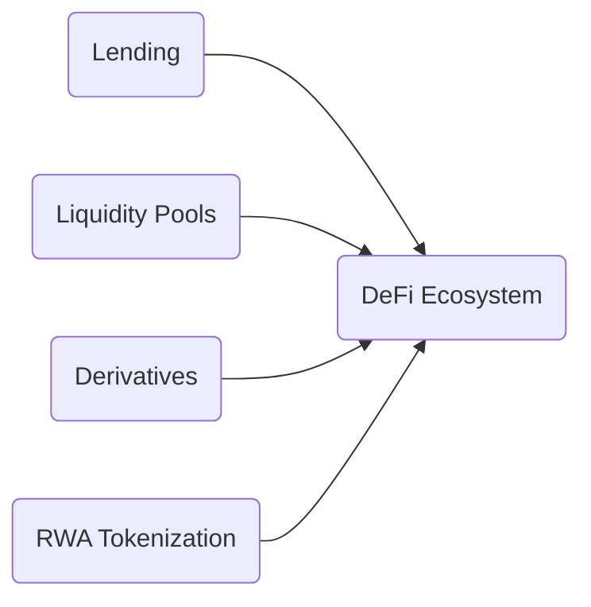

---

# **Slide 10 — Compound & Aave**
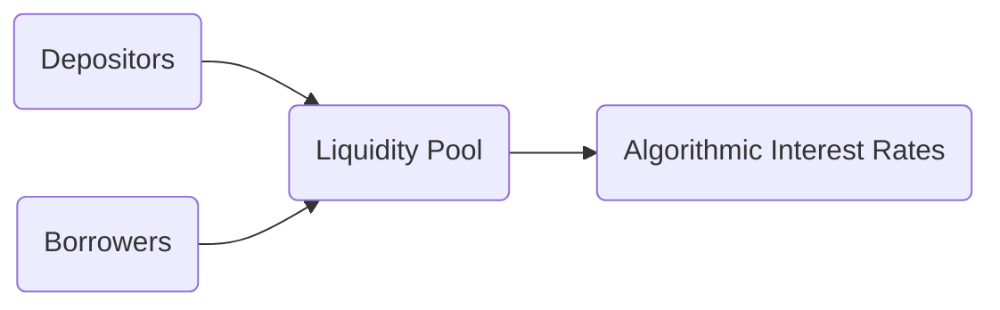

---

# **Slide 11 — Blockchain Trilemma**
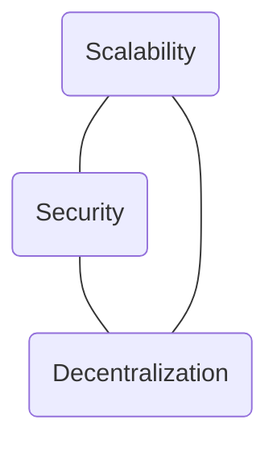

---

# **Slide 12 — Layer‑2 Overview**
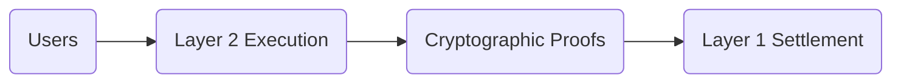

---

# **Slide 13 — Payment Channels**
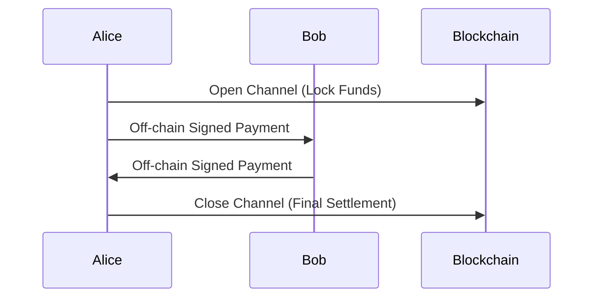

---

# **Slide 14 — Rollups**
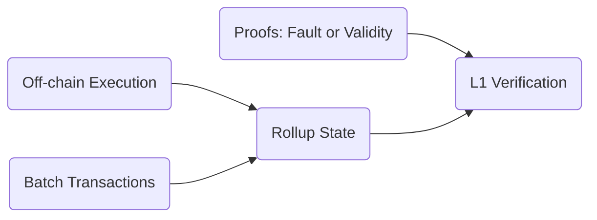

---

# **Slide 15 — RealT Tokenization**
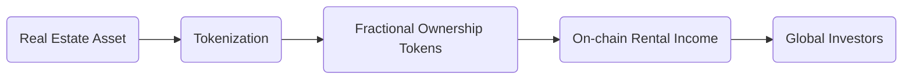

---

# **Slide 16 — AI + Blockchain**
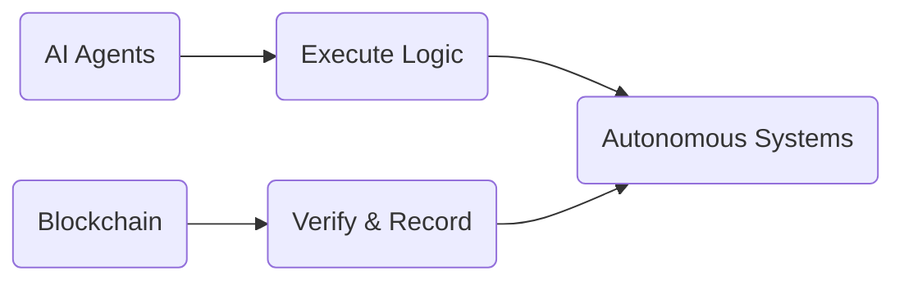

---

# **Slide 17 — SpaceKitJS**
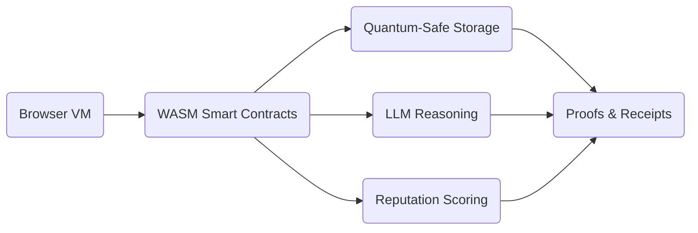

---

# **Slide 18 — OmniChain Payments (Case Study)**
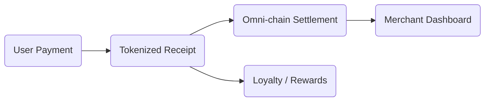

---

# **Slide 19 — The Future**
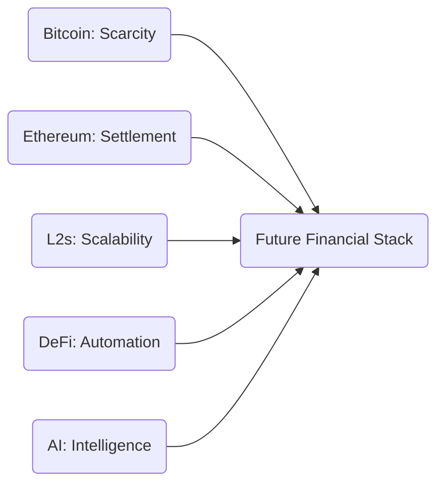
