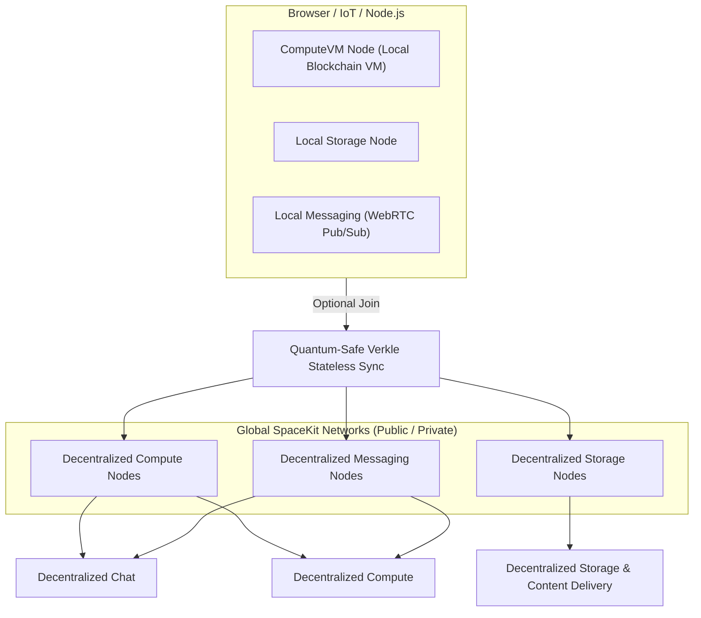
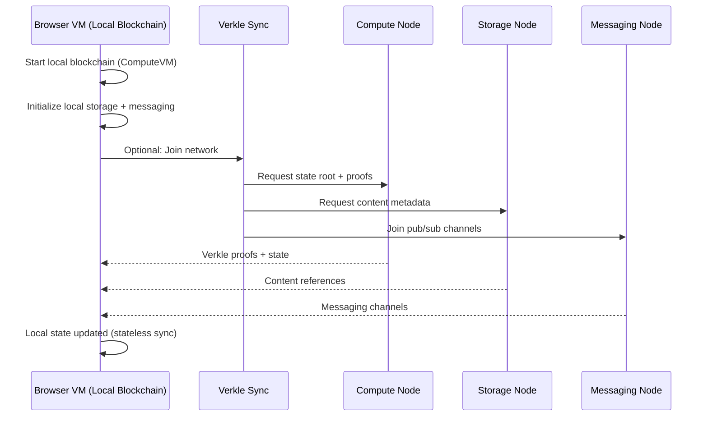

# SpaceKit Architecture

SpaceKit is a decentralized network of compute, storage, messaging, and networking nodes. It is designed to be a quantum-safe, AI-native, DID-centric orchestration platform.

## Local Environment
Each user's browser, IoT device, or Node.js server is a node on the network. It runs a local blockchain (ComputeVM) with local storage and messaging. It can optionally join a global network of compute, storage, and messaging nodes.

### Local Environment Diagram

## Stateless Sync
Stateless sync is a technique where the local blockchain is synced with the global network by requesting the state root and proofs from the global network. The local blockchain is then updated with the proofs and state.

### Stateless Sync Sequence Diagram
