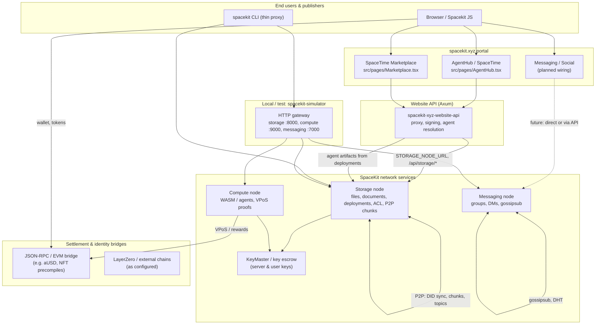
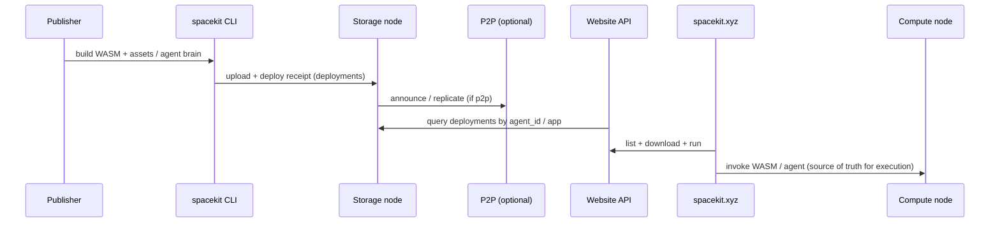

# SpaceKit Universe — services, marketplace, and social layer

This document describes how **SpaceKit services** interact, how they support the **SpaceKit Marketplace** (free vs paid content), and how **spacekit.xyz** + **website-api** act as the UI and control plane toward a **decentralized, topic-scoped app economy** (user-run “Steam” / “App Store” regions).

---

## 1. Service interaction diagram

Users and operators connect through **TLS HTTP** and **libp2p** (where enabled). **DID** ties identity across storage, messaging, and compute. **Compute** is the execution and policy “source of truth” for WASM and agent runs; **storage** is the durable artifact and document plane; **messaging** is the real-time and social graph transport.

**Data flow — deploy an agent (today)**  
1. Publisher runs `spacekit storage deploy` → artifacts land on **storage**; receipt stored under `deployments/{deployment_id}`.  
2. **Website API** resolves `agent_id` → `file_id`s via storage `deployments` query (see `spacekit.xyz-website-api` README).  
3. **AgentHub** fetches WASM/brain through the API (and/or storage) using the user’s keys where required.

**Edge vs source of truth**  
- **Storage**: durable bytes, metadata, ACL, replication topics, deployment index.  
- **Compute**: authoritative **execution** and verification (WASM runs, proofs).  
- **Website / API**: discovery, listing, email, and safe proxying — not a replacement for on-chain or node policy.

---

## 2. Marketplace compatibility (SpaceKit Marketplace today)

The current **SpaceTime Marketplace** UI (`spacekit.xyz-website/src/pages/Marketplace.tsx`) models listings with:

- `app_id`, `deployment_id`, `publisher_did`, `marketplace_id`
- `artifacts[]` with `role`, `file_id`
- `access`, `pricing` (e.g. `amount_ausd`, subscription, pay-per-use)

The **updated storage model** remains compatible:

| Concern | How it fits |
|--------|-------------|
| **Listing index** | Still served as **documents** / app metadata (storage or API-backed JSON) pointing at `file_id`s and `deployment_id`. |
| **Artifact hosting** | Same as agent deploy: WASM + companion assets on **storage node**; optional P2P replication. |
| **Free apps** | **Server-mediated crypto path**: the **storage node** (or a trusted service role) can encrypt/decrypt using **service keys** via KeyMaster / envelope flows so the **browser never needs the publisher’s key** for every read. The website API can proxy with `STORAGE_NODE_SECRET` and admin DID where policy allows. |
| **Paid / subscription** | **Asymmetric path**: publisher/owner encrypts to **buyer/user** public keys (Kyber / SpaceKit KEM); only the purchaser can decrypt locally — aligned with **AgentHub** patterns (`encryptedFetch`, user keys). |
| **ACL** | Persistent **file access grants** (owner + grantee DIDs) support “who may read this deployment” without exposing server-side decryption to everyone. |

So: **yes** — the same marketplace can evolve from a single global catalog to **many marketplaces** (per `marketplace_id` / topic) without changing the fundamental “listing points at storage `file_id`s” model.

---

## 3. Decentralized “Steam per topic” vision

**Goal:** Any community can run an **App Store / Steam-like** storefront for a **topic** (or set of topics), backed by SpaceKit services.

- **Catalog** = metadata + pricing + `deployment_id` + storage references (unchanged conceptually).  
- **Discovery** = optional **gossipsub topics** (e.g. `spacekit/files/v1`, future `spacekit/marketplace/{id}/v1`) + HTTP indexes.  
- **Trust** = publisher DIDs, optional on-chain entitlements, compute verification for paid runs.  
- **Operator economics** = storage **ASTRA / aUSD** style settlement hooks (rewards + `SPACEKIT_SETTLEMENT_URL`) so edge operators can be paid for serving bytes and latency.

This is an **incremental** path: the **SpaceKit Marketplace** on spacekit.xyz is the first-party UI; the same APIs support **federated** frontends and topic-scoped stores later.

---

## 4. Packaging and propagation: apps, webapps, dapps, agents

- **Storage** = package registry and CDN-like edge cache (with P2P assist).  
- **Compute** = **source of truth for execution** (what actually ran, proofs, policy).  
- **Website** = **human UI** and curated discovery, not the only possible frontend.

---

## 5. spacekit.xyz and website-api roles

| Layer | Role |
|--------|------|
| **spacekit.xyz** | React app: **SpaceTime** (`/spacetime`), **Agent Hub** (`/agents`), **Marketplace** (`/marketplace`), **Messaging** (`/messaging` — DMs, block list, public directory); wallet, DID UX. |
| **spacekit-xyz-website-api** | HMAC email, **storage** + **messaging** proxy (`/api/messaging/*` → `MESSAGING_NODE_URL`), **social directory** (`/api/social/directory`), **agent artifact resolution** from `deployments`, CORS. |
| **Storage node** | Artifacts, documents, **ACL**, optional **P2P** topics, deployment receipts. |
| **Messaging node** | DMs, groups, blocks, public discovery flags — to be fully wired from Messaging page. |
| **Compute node** | Agent/WASM runs, VPoS-style settlement integration points. |

Files of note:

- `spacekit.xyz-website/src/pages/AgentHub.tsx` — agents, encrypted artifact fetch, wallet.  
- `spacekit.xyz-website/src/pages/Marketplace.tsx` — listings, pricing, `file_id` artifacts.  
- `spacekit.xyz-website-api/README.md` — env vars, storage proxy, deployment query behavior.

---

## 6. Messaging, social, and UGC (roadmap alignment)

| Capability | Direction |
|------------|------------|
| **DMs** | Messaging node + DID identity; website page calls API or **direct** node URLs per deployment. |
| **Groups (Reddit-like)** | Group keys + shared encryption (`spacekit-messaging-node` group paths); admin/mod roles in app layer. |
| **Discover users** | **Public** directory bit + **invite** graph; no forced global directory — privacy by default. |
| **Block** | Server-side and client-side **block lists** (DID-based) in messaging service + UI filter. |
| **UGC (YouTube / Instagram style)** | Large media → **storage** uploads; feeds = documents + **topics**; social graph from messaging + follows (product schema on top of same storage + messaging primitives). |

---

## 7. Related repo docs

- `spacekit-storage-node/README.md` — node features, API surface, P2P, ACL.  
- `spacekit-simulator/README.md` — local gateway ports, dev workflows.  
- `spacekit-cli` — thin proxy; `spacekit storage deploy` for agent bundles.  
- `docs/INTENT-PAYMENT-ARCHITECTURE.md` — payments / intents where applicable.  
- `UNIFICATION_STRATEGY.md` — cross-repo unification notes.

---

*Last updated to reflect production-oriented storage (persistent ACL, P2P chunk/record path, topic subscriptions, settlement hooks) and the SpaceKit portal + API split.*
