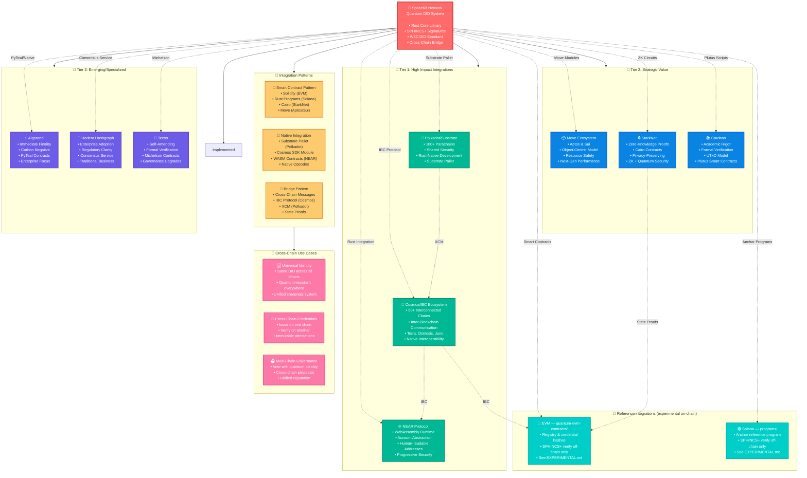

# Potential Integrations

Looking at the blockchain landscape, here are the major platforms I think would be most valuable to integrate with the SpaceKit Network quantum DID system:

## 🏗️ **Complete Multi-Chain Architecture**

The SpaceKit Network Quantum DID system is designed to work seamlessly across all major blockchain ecosystems, providing universal quantum-resistant identity:

### **🎯 Key Architecture Principles:**

1. **Universal Compatibility**: One quantum DID works across all blockchain ecosystems
2. **Native Integration**: Each chain uses its optimal integration pattern (smart contracts, native modules, etc.)
3. **Cross-Chain Communication**: Leverages each ecosystem's interoperability protocols (IBC, XCM, bridges)
4. **Quantum Security**: SPHINCS+ signatures provide future-proof security on every chain
5. **Modular Design**: Add new blockchain integrations without affecting existing ones

## 🌟 **Tier 1 Priority - High Impact**

### **NEAR Protocol** 
- **Why**: WebAssembly-based, developer-friendly, human-readable addresses
- **Unique Value**: Account abstraction built-in, progressive security model
- **Integration Style**: Similar to Solana with smart contracts, but with easier onboarding

### **Cosmos/IBC Ecosystem**
- **Why**: Massive interchain ecosystem (50+ chains), built for interoperability
- **Unique Value**: IBC protocol would allow quantum DIDs to work across ALL Cosmos chains simultaneously
- **Integration Style**: Single implementation works on Terra, Osmosis, Juno, Cosmos Hub, etc.

### **Polkadot/Substrate**
- **Why**: Parachain ecosystem, shared security, native interoperability
- **Unique Value**: One integration potentially works across 100+ parachains
- **Integration Style**: Substrate pallet that any parachain can include

## 🚀 **Tier 2 - Strategic Value**

### **Aptos & Sui** (Move Ecosystem)
- **Why**: Next-gen performance, object-centric model, growing rapidly
- **Unique Value**: Move language's resource safety aligns well with identity security
- **Integration Style**: Move modules with object-based credential storage

### **StarkNet** (ZK-Rollups)
- **Why**: Zero-knowledge proofs + quantum resistance = ultimate privacy
- **Unique Value**: Private credential verification without revealing content
- **Integration Style**: Cairo contracts with ZK proof integration

### **Cardano**
- **Why**: Academic rigor, formal verification, UTxO model
- **Unique Value**: Mathematical proofs of quantum signature correctness
- **Integration Style**: Plutus smart contracts, possibly native quantum primitives

## 🔮 **Tier 3 - Emerging/Specialized**

### **Algorand**
- **Why**: Institutional adoption, carbon-negative, immediate finality
- **Unique Value**: Quantum security + environmental sustainability story
- **Integration Style**: PyTeal smart contracts or native quantum opcodes

### **Hedera Hashgraph**
- **Why**: Enterprise adoption, different consensus model, regulatory clarity
- **Unique Value**: Traditional enterprise + quantum security combination
- **Integration Style**: Hedera Consensus Service for immutable DID records

### **Tezos**
- **Why**: Self-amending blockchain, formal verification culture
- **Unique Value**: Can upgrade quantum algorithms without hard forks
- **Integration Style**: Michelson contracts with upgrade governance

## 💭 **Strategic Considerations:**

### **Developer Experience Priority:**
1. **NEAR** - Easiest developer onboarding
2. **Cosmos** - Familiar if you know blockchain development
3. **Polkadot** - Rust-native, matches your core library

### **Performance Priority:**
1. **Sui/Aptos** - Highest theoretical throughput
2. **Solana** - Proven high performance (already done)
3. **StarkNet** - ZK-optimized performance

### **Ecosystem Size:**
1. **Cosmos** - 50+ interconnected chains
2. **Polkadot** - 100+ parachains potential
3. **NEAR** - Growing rapidly with strong funding

### **Unique Technical Benefits:**

- **Cosmos**: Cross-chain by default via IBC
- **StarkNet**: Privacy-preserving quantum signatures
- **Polkadot**: Shared security across parachains
- **NEAR**: Progressive security (quantum keys for high-value operations)
- **Move chains**: Resource safety prevents credential double-spending

## 🎯 **My Recommendation:**

If I had to pick **one next integration**, I'd choose **Cosmos** because:
1. Single integration works across 50+ chains
2. IBC enables true cross-chain quantum identity
3. Large, active developer ecosystem
4. Natural fit for identity applications (many Cosmos chains are app-specific)

**NEAR** would be second choice for developer experience and the **Move ecosystem** (Aptos/Sui) third for next-generation performance.

The quantum DID system's architecture is flexible enough that each blockchain integration could leverage its unique strengths while maintaining compatibility with your core Rust library!