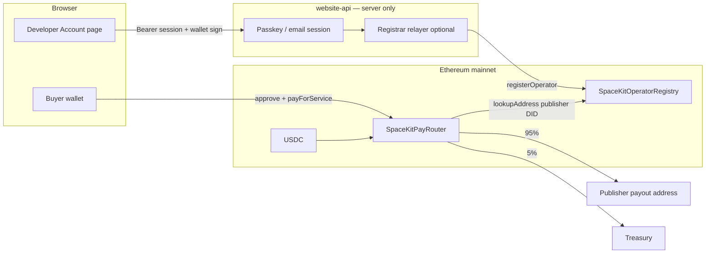

# SpaceKit Marketplace Pay — setup & deployment guide

This guide is for **SpaceKit operators** (people running `spacekit.xyz-website-api` + contracts) and **game/app publishers** (developers selling paid listings).

**Summary:** Buyers pay **USDC on Ethereum mainnet** via `SpaceKitPayRouter`. **95%** goes to the publisher’s registered payout wallet, **5%** to treasury. SpaceKit **never holds user USDC** and **never has access to publisher or buyer private keys**.

---

## Architecture



### Components

| Component | Repo path | Role |
|-----------|-----------|------|
| `SpaceKitOperatorRegistry` | `spacekit-pay/SpaceKitOperatorRegistry.sol` | Maps `did:spacekit:user:<name>` → Ethereum payout address |
| `SpaceKitPayRouter` | `spacekit-pay/SpaceKitPayRouter.sol` | Routes USDC from buyer to publisher + treasury |
| `website-api` | `spacekit.xyz-website-api` | Verifies purchase txs; optional payout registration relayer |
| `website` | `spacekit.xyz-website` | Marketplace checkout + Account payout UI |
| `spacekit-cli` | `spacekit-cli` | `--price 1.00` → listing `amount_cents: 100` |

### Money flow (non-custodial)

1. Buyer connects wallet, approves USDC, calls `payForService(USDC, publisherDID, amount)`.
2. Router reads publisher payout from `OperatorRegistry`.
3. USDC moves **directly** buyer → publisher wallet (95%) and treasury (5%).
4. `website-api` only **reads** the chain (tx receipt + events) to unlock app artifacts. It does **not** custody funds.

Publishers “download” / receive money in **their own wallet** — the address they registered. SpaceKit does not run a balance or withdrawal step for sellers.

---

## Secrets: what is exposed where

**Important:** `PAY_REGISTRAR_PRIVATE_KEY` is **not** exposed to users, browsers, or other developers’ machines. It lives only in the **website-api server `.env`**, same class of secret as `API_SECRET` or `RESEND_API_KEY`.

| Variable | Where | Who sees it | Purpose |
|----------|-------|-------------|---------|
| `PAY_REGISTRAR_PRIVATE_KEY` | API `.env` only | Server ops | Submit `registerOperator` txs (gas payer) |
| `API_SECRET` | API `.env` only | Server ops | HMAC / internal auth |
| `ETH_RPC_URL` | API `.env` only | Server ops | Read chain + relayer sends |
| `PRIVATE_KEY` (deploy) | Your machine during deploy | Deployer | Deploy contracts (one-time) |
| `VITE_SPACEKIT_PAY_ROUTER_ADDRESS` | Website build / `.env` | **Public** (in JS bundle) | Router address for wagmi |
| `VITE_SPACEKIT_OPERATOR_REGISTRY_ADDRESS` | Website build | **Public** | Registry address (read-only in UI) |

Nothing starting with `VITE_` should ever contain a private key.

### What the registrar key **can** and **cannot** do

**Can:**

- Call `registerOperator(did, payoutAddress)` on the registry contract
- Spend **ETH** on that wallet for gas

**Cannot:**

- Move USDC out of buyer or seller wallets
- Call `payForService` on behalf of users without their signatures
- Steal already-received USDC from a publisher wallet

**If the registrar key leaks:** an attacker could register **wrong payout addresses for DIDs** (before the real owner registers). That affects **future** sales, not wallets directly. Mitigations: use a dedicated hot wallet with minimal ETH, rotate via `setRegistrar`, monitor `OperatorRegistered` events.

---

## Do you need `PAY_REGISTRAR_PRIVATE_KEY` at launch?

**No — not until you want self-service payout registration on the Account page.**

With **zero customers**, the simplest path:

1. Deploy contracts.
2. Set `REGISTRAR_ADDRESS` to **your admin wallet** (or hardware wallet you control).
3. **Manually** register each publisher after you verify their identity (support ticket, Discord, etc.).
4. Omit `PAY_REGISTRAR_PRIVATE_KEY` from website-api — purchases still work; Account “Register payout” shows *not configured*.

When you want publishers to register themselves:

1. Create a **new** hot wallet (not your deployer/owner key).
2. Owner calls `setRegistrar(hotWallet)` on the registry.
3. Fund hot wallet with a small amount of ETH (~$20 is plenty for many registrations).
4. Set `PAY_REGISTRAR_PRIVATE_KEY` on the API server only.

This keeps the relayer optional and avoids putting any server key in production until you need automation.

---

## Phase A — Deploy contracts (operator)

### Prerequisites

- [Foundry](https://book.getfoundry.sh/getting-started/installation)
- Ethereum mainnet RPC (Alchemy, Infura, etc.)
- Deployer wallet with ETH for deployment gas
- Treasury address (protocol 5% fee)

### Commands

```bash
cd spacekit.xyz-contracts

# First time only
forge install OpenZeppelin/openzeppelin-contracts@v5.0.2 --no-commit

export RPC_URL=https://eth-mainnet.g.alchemy.com/v2/YOUR_KEY
export PRIVATE_KEY=0x...                    # deployer → contract owner
export TREASURY_ADDRESS=0x...               # receives 5%
export USDC_ADDRESS=0xA0b86991c6218b36c1d19D4a2e9Eb0cE3606eB48

# Early stage: you are the registrar (manual payout registration)
export REGISTRAR_ADDRESS=0xYOUR_ADMIN_WALLET

# Later: dedicated hot wallet for API relayer
# export REGISTRAR_ADDRESS=0xYOUR_HOT_WALLET

forge script script/DeploySpaceKitPayEthereum.s.sol:DeploySpaceKitPayEthereum \
  --rpc-url "$RPC_URL" \
  --broadcast
```

Save the printed addresses:

- `SpaceKitOperatorRegistry`
- `SpaceKitPayRouter`

Verify on Etherscan if you used `--verify`.

---

## Phase B — Manual publisher payout (early stage, no API key)

After you confirm a developer owns `did:spacekit:user:<username>` (they signed up on SpaceKit with that username):

```bash
export REGISTRY=0x...   # SpaceKitOperatorRegistry
export RPC_URL=https://eth-mainnet.g.alchemy.com/v2/...

cast send "$REGISTRY" \
  "registerOperator(string,address)" \
  "did:spacekit:user:astor" \
  0xDEVELOPER_PAYOUT_WALLET \
  --rpc-url "$RPC_URL" \
  --private-key "$REGISTRAR_PRIVATE_KEY"
```

Use the key for `REGISTRAR_ADDRESS` (your admin wallet at deploy time).

Confirm:

```bash
cast call "$REGISTRY" \
  "lookupAddress(string)(address)" \
  "did:spacekit:user:astor" \
  --rpc-url "$RPC_URL"
```

**Publisher checklist:**

- SpaceKit account with claimed username (`did:spacekit:user:<name>`)
- Payout address registered on-chain (manual or Account page)
- Paid app published with `--price`

---

## Phase C — Wire website-api

Copy `spacekit.xyz-website-api/.env.example` → `.env`.

### Required for payment verification (production)

```bash
ETH_RPC_URL=https://eth-mainnet.g.alchemy.com/v2/...
SPACEKIT_PAY_ROUTER_ADDRESS=0x...
OPERATOR_REGISTRY_ADDRESS=0x...
USDC_ADDRESS=0xA0b86991c6218b36c1d19D4a2e9Eb0cE3606eB48
ETH_CHAIN_ID=1
MARKETPLACE_VERIFY_PAYMENTS=true
```

### Optional — self-service Account payout registration

Only when the Account page should submit registrations for users:

```bash
PAY_REGISTRAR_PRIVATE_KEY=0x...
```

Requirements:

- Address derived from this key **must equal** `registrar` on the deployed registry
- Wallet holds enough ETH for gas

If omitted: `GET /api/marketplace/payout` works; `POST .../challenge` and `.../register` return *not configured*.

### Local dev without chain

```bash
MARKETPLACE_VERIFY_PAYMENTS=false
```

**Never use this on mainnet production** — it skips tx verification.

Restart API after env changes.

---

## Phase D — Wire website

```bash
# spacekit.xyz-website/.env
VITE_SPACEKIT_PAY_ROUTER_ADDRESS=0x...
VITE_SPACEKIT_OPERATOR_REGISTRY_ADDRESS=0x...
```

Rebuild / redeploy the static site. Chain config is **Ethereum mainnet USDC** (`src/config/appChain.ts`).

---

## Phase E — Publisher: ship a paid game

```bash
spacekit app deploy \
  --publish \
  --category games \
  --price 1.00 \
  --title "My Game" \
  ...
```

- `--price 1.00` → **100 cents** → **1.00 USDC** (6 decimals: `1_000_000` atoms)
- Listing `publisher_did` comes from deploy `owner_did` — must match registry entry

---

## Phase F — Buyer purchase flow

1. Sign in on spacekit.xyz (passkey / email).
2. Connect wallet on **Ethereum mainnet**.
3. Hold **USDC** + small **ETH** for gas.
4. Marketplace → **Buy** → approve USDC (once) → `payForService`.
5. API verifies `PaymentRouted` event → records purchase → app unlocks.

API endpoint: `POST /api/marketplace/purchase` with `tx_hash`, `app_id`, `buyer_did`.

---

## Self-service payout (Account page)

When `PAY_REGISTRAR_PRIVATE_KEY` is configured:

1. Developer signs in (proves username claim via session).
2. Connects Ethereum wallet on mainnet.
3. Clicks **Register payout address** on Account.
4. Signs EIP-191 message binding DID + payout address + chain id.
5. API validates session + signature + `did_registry`, then relayer calls `registerOperator`.

### API routes

| Method | Path | Auth |
|--------|------|------|
| `GET` | `/api/marketplace/payout` | Bearer session |
| `POST` | `/api/marketplace/payout/challenge` | Bearer session + `{ payout_address }` |
| `POST` | `/api/marketplace/payout/register` | Bearer session + `{ challenge, mac, signature }` |

### Why not let developers call `registerOperator` directly?

A public `registerOperator(did, wallet)` lets **anyone** point **any** DID at **their** wallet (squatting). The registrar gate fixes that:

- **Session** → proves SpaceKit username claim
- **Wallet signature** → proves payout address consent
- **Registrar-only write** → only SpaceKit can update the mapping after both checks

Wallet signature alone on-chain cannot prove ownership of `did:spacekit:user:astor` because that claim lives in SpaceKit auth, not on Ethereum.

---

## Switching to API relayer later

```bash
# 1. Generate new hot wallet (keep key off laptops you don't trust for prod)
cast wallet new

# 2. Fund with ETH

# 3. Owner updates registrar on-chain
cast send "$REGISTRY" \
  "setRegistrar(address)" \
  0xNEW_HOT_WALLET \
  --rpc-url "$RPC_URL" \
  --private-key "$OWNER_PRIVATE_KEY"

# 4. Set on API server only
PAY_REGISTRAR_PRIVATE_KEY=0x...
```

---

## Troubleshooting

| Symptom | Likely cause |
|---------|----------------|
| Purchase fails verification | Wrong router address, wrong chain, insufficient USDC amount, or `publisher_did` not registered |
| `lookupAddress` returns zero | Publisher never registered payout for that DID |
| Account payout “not configured” | `PAY_REGISTRAR_PRIVATE_KEY` / `OPERATOR_REGISTRY_ADDRESS` missing on API |
| `registerOperator` reverts | Caller is not `registrar` |
| Buyer pay succeeds but app locked | API env wrong, or `MARKETPLACE_VERIFY_PAYMENTS=false` mismatch |
| 95% went to wrong wallet | Registry mapping wrong — fix with new `registerOperator` for that DID |

---

## FAQ

### Does SpaceKit hold our money?

No. USDC transfers happen in the router contract from buyer → publisher wallet in the same transaction.

### Why a server key at all?

Only to **pay gas** and **submit** `registerOperator` after off-chain identity checks — so developers don’t need ETH just to register payout, and so random wallets can’t squat DIDs. It is **optional at launch** if you register payouts manually.

### Can we use testnet first?

Deploy the same scripts on Sepolia with test USDC, set `ETH_CHAIN_ID` accordingly, and point website `appChain.ts` / env at testnet. Mainnet is the current production target for marketplace.

### Does every seller need their own router?

No. One network-wide `SpaceKitPayRouter` + `SpaceKitOperatorRegistry`. Each seller registers their DID → payout address.

### Is aUSD still used?

Deprecated for marketplace checkout. Use USDC on Ethereum for new paid listings.

---

## Related files

- Quick deploy: [`DEPLOY_ETHEREUM.md`](./DEPLOY_ETHEREUM.md)
- Contracts: `spacekit-pay/`
- Deploy script: `spacekit.xyz-contracts/script/DeploySpaceKitPayEthereum.s.sol`
- API payment verify: `spacekit.xyz-website-api/src/marketplace_payments.rs`
- API payout relayer: `spacekit.xyz-website-api/src/operator_payout.rs`
- Account UI: `spacekit.xyz-website/src/components/DeveloperPayoutCard.tsx`
