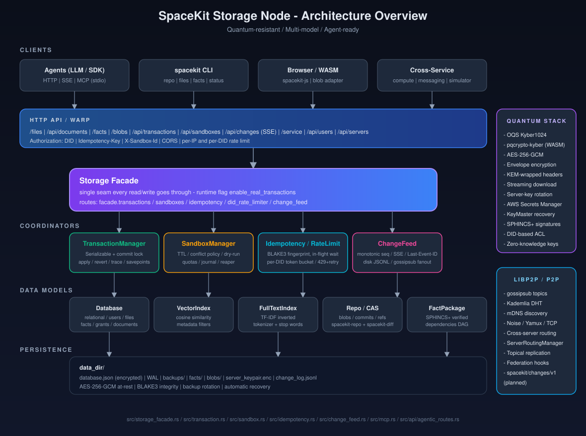
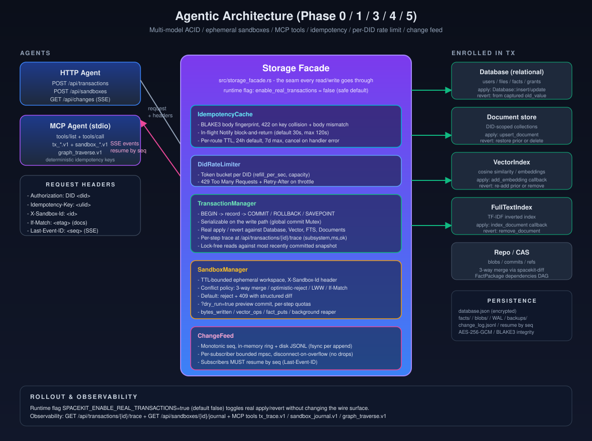

# SpaceKit Storage Node

[](https://www.rust-lang.org)
[](#license)

### What this crate is (core vs starter plugins)

**One-line core:** an **agent-native, quantum-aware, multi-model storage engine**—custom ACID database engine, content-addressed blobs/facts, DID-scoped access, unified [`storage_facade`](src/storage_facade.rs) (transactions, idempotency, sandboxes, change feed), and an HTTP API skeleton.

**Breadth is optional layers.** Most optional surfaces compile in as Cargo **features**—treat them as **starter plugins** (same idea as Postgres extensions: tight core, composable extras). Longer-term: workspace crates → third-party MCP sidecars → WASM for sandboxed extensions.

**Curated `--lib` builds** (`spacekit_storage_node` has no default `main`; build your own or use **`standalone`**):

| Preset | Audience | Command |
|--------|----------|---------|
| **Agentic core** | Backends needing HTTP + storage + PQ + MCP (no libp2p mesh) | `cargo build --no-default-features --features "api-server,database,quantum,mcp" --lib` |
| **Storage + API, private** | Single-region / VPC | `cargo build --no-default-features --features "api-server,database,quantum" --lib` |
| **Peer / mesh** | Default SpaceKit networking stack | `cargo build --features "api-server,database,p2p,quantum" --lib` |

> **Design principle:** a plugin layout does **not** replace a sharp core—it **depends** on it.

The **`spacekit-storage-node`** CLI binary is gated on Cargo feature **`standalone`** (that preset pulls `p2p` today). Embed the Rust library crate **`spacekit_storage_node`** under a different binary entrypoint when you want the smallest deployable artifact.

### When to use SpaceKit Storage Node

- **Use it for:** agent fleets that need TTL sandboxes plus multi-model transactions; PQ envelopes for user-owned ciphertext; DID-native ACL; CAS-backed repos; SSE change feeds for automation.
- **Probably overkill for:** a vanilla CRUD app glued to Postgres; embeddings-only workloads where a hosted vector DB is simpler; workloads that fit S3-style object storage alone.
- **Not yet a fit (today):** global edge SLA at sub-100ms end-to-end; petabyte OLTP-row-store workloads per socket; turnkey SOC2/HIPAA—you must run compliance with us, not infer it from markdown.

### At a glance: SpaceKit vs common databases

Directional—not a benchmark.

| Capability | Postgres | SQLite | SurrealDB | SpaceKit |
|-------------|----------|--------|-----------|-----------|
| Structured relational-style queries (`POST /query/*`, JSON DSL) | ✅ (SQL + JSON) | ✅ (SQL + JSON helpers) | ✅ | ✅ (JSON only, not SQL) |
| Vector + FTS surfaced in-tree | ⚙️ extensions | ❌ | ✅ | ✅ |
| Multi-model **Serializable** commits across row/doc/vector/FTS in **one façade** | ⚙️ | ❌ | ✅ | ✅ <sup>*</sup> |
| PQ KEM + AES-GCM envelope stack shipped in-repo | ❌ | ❌ | ❌ | ✅ (`quantum` flags) |
| Ephemeral agent sandboxes (TTL workspaces + conflict policy + journals) | ❌ | ❌ | ⚙️ | ✅ |
| Idempotency keys + block-on-in-flight dedup on writes | ❌ | ❌ | ⚙️ | ✅ |
| In-process MCP server (stdio tool catalog) | ❌ | ❌ | ⚙️ | ✅ (`mcp`) |
| Server-Sent Events change feed | ❌ | ❌ | ⚙️ | ✅ |

<sup>*</sup> **Serializable row:** real persisted apply/revert after `COMMIT` defaults **on**; opt out with **`SPACEKIT_ENABLE_REAL_TRANSACTIONS=false`**. Guide: **[`multi-model-transactions.md`](documentation/guides/multi-model-transactions.md)**.

### Production status (honest)

| Area | State |
|------|--------|
| **PQ envelopes, CAS repo hosting, NFT + fact crates, structured querying** | Substantial Rust code paths landed; vet per your workload + threat model. |
| **Multi-model transactions** | Real apply/revert on by default; stub finalize counters stay on **`GET /api/agentic/health`** as regression signals. |
| **Upload tokens** | **`POST /api/upload-tokens`** mints short-lived **`Authorization: UploadToken`** for browser/blob uploads — [`upload-tokens.md`](documentation/guides/upload-tokens.md). |
| **MCP workspaces** | **`workspace_create/get/list.v1`** + **`upload_token_mint.v1`** on stdio MCP — [`mcp.md`](documentation/guides/mcp.md). |
| **Auth staging** | Hybrid → strict rollout; `hybrid_auth_soak` / `strict_auth_soak` — [`blob-fact-auth-staging.md`](documentation/guides/blob-fact-auth-staging.md). |
| **Federation handoff** | Export/import + HMAC `handoff_signature` — [`federation-workspace-handoff.md`](documentation/guides/federation-workspace-handoff.md). |
| **DID-signed migration** | v2 manifests, SPHINCS+ counter-sign, audit facts — [`did-signed-migration.md`](documentation/guides/did-signed-migration.md), spec [`DID-MIGRATION.md`](DID-MIGRATION.md). |
| **Federation roadmap** | Design memo, `GET /api/operators/self`, handoff — [`federation-design.md`](documentation/guides/federation-design.md). |
| **Phase 2 readiness** | Launch assessment — [`phase-2-readiness.md`](documentation/guides/phase-2-readiness.md). |
| **Sandboxes + change feeds + MCP** | HTTP + MCP + metrics live; durable sandbox journals + gossipsub fan-out remain Phase 12 work. |
| **Operator HTTP** | **`GET /health`**, **`GET /api/agentic/health`**, **`GET /api/agentic/metrics`** (Prometheus text). Programmatic **`Database::checkpoint`**, integrity, backups remain **Rust-only** until we add **`/api/database/*`** equivalents. |
| **Fact compression** | Gzip delegates to the shared `spacekit-compressor`; Zstd/Lz4/Brotli and storage framing remain local. Existing records store only a compressed boolean, so the configured algorithm must remain stable until per-record codec metadata or a versioned blob envelope is introduced. |

### Hello, agent (±30 seconds)

```bash
# Terminal A — standalone binary needs `standalone,mcp`:
cargo build --release --features "standalone,mcp"
./target/release/spacekit-storage-node start \
  --did did:spacekit:dev:node --enable-api true --data-dir ./data --port 3030 &

# Terminal B — JSON-RPC MCP over stdio (shares `--data-dir` + DID context)
echo '{"jsonrpc":"2.0","id":1,"method":"tools/list","params":{}}' | \
  ./target/release/spacekit-storage-node mcp --data-dir ./data --did did:spacekit:mcp:dev
```

Structured HTTP choreography for agents (DID headers, idempotency, sandboxes):

[`examples/agentic_client_demo.rs`](examples/agentic_client_demo.rs)

**Canonical MCP docs** (`graph_traverse.v1` **`max_depth` ≤ 50**): [`documentation/guides/mcp.md`](documentation/guides/mcp.md)

---

Distributed storage for SpaceKit workloads: PQ file envelopes (`quantum`), Git-style repos on CAS blobs, NFT + facts, DID registry, community/marketplace HTTP routes—each area **opt-in via Cargo features**.

Repository guide: **[`documentation/guides/spacekit-repository-hosting.md`](documentation/guides/spacekit-repository-hosting.md)**.

More depth: **[`documentation/README.md`](documentation/README.md)** • **[`documentation/ENCRYPTION_AND_SECURITY.md`](documentation/ENCRYPTION_AND_SECURITY.md)** • **[NFTs](documentation/guides/nft-collections.md)** • **[Facts](documentation/CONTENT_FACT_PACKAGE_INTEGRATION.md)**.

Monorepo context (optional): **`../docs/SPACEKIT_UNIVERSE_ARCHITECTURE.md`**.

## Architecture

<p align="center">
  
</p>

<p align="center">
  
</p>

The Warp stack terminates HTTP, DID-authenticates, applies IP + DID rate limits when configured, then funnels mutations through **[`storage_facade`](src/storage_facade.rs)** into the relational engine, DID-scoped docs, FTS/Vector indexes, and CAS blobs + `FactPackage` graphs. PQ crypto, libp2p, AWS Secrets, MCP, etc., activate per Cargo flags (see **[Feature Flags](#feature-flags)**).

## Capabilities (starter plugins vs core posture)

Parallel rows: one concern per line; the right column names the Cargo feature bundle (see **[Feature flags](#feature-flags)**).

| Concern | Feature bundle |
|---------|----------------|
| PQ envelopes + uploads + rotation | **`quantum`** · optional **`aws-secrets`** |
| Custom DB + WAL + encrypted backups (**no mandatory external DB**) | **`database`** · optional **`sqlite`** (`rusqlite` analytics only) |
| Structured querying over rows/facts/users/docs (`POST /query/*`) | Always on when **`api-server` + `database`** |
| Peer mesh | **`p2p`** |
| HTTP control plane | **`api-server`** |
| MCP tool server | **`mcp`** (stdio JSON-RPC companion) |

### Performance posture

Hot paths bias toward **indexed in-memory lookups** rather than interpreting SQL text or round-tripping a remote query engine—that is architectural, not proof of superiority. **Benchmark your own workloads**; we deliberately avoid speculative multipliers without a reproducible harness.

### Agent primitives

Every write routed through **`storage_facade`** gets **idempotency keys** (`Idempotency-Key` + BLAKE3 body fingerprint, block-and-return on in-flight collisions), **per-DID token buckets**, optional **`rate-limit-spacekit`** federation, **`SandboxManager`**, a **SERIALIZABLE-on-the-write-path** façade contract, **`GET /api/changes`** with disk-backed **`change_log.jsonl`**, and **`spacekit-storage-node mcp`** where you built with **`mcp`**.

Deep dives: [`multi-model-transactions.md`](documentation/guides/multi-model-transactions.md) · [`sandboxes.md`](documentation/guides/sandboxes.md) · [`change-feed.md`](documentation/guides/change-feed.md) · [`mcp.md`](documentation/guides/mcp.md).

## Installation

### Prerequisites

Rust **1.70+** via [rustup](https://rustup.rs/).

The engine itself needs **zero mandatory hosted databases**. Optional crates bring their own natives when features are toggled (**OQS, libp2p, rusqlite, aws-sdk**, etc.—see Cargo.toml).

```bash
git clone https://github.com/spacekit-xyz/spacekit-core.git
cd spacekit-core/infra/spacekit-storage-node
cargo build --release
cargo test
```

### Feature flags

Cargo features behave like **starter plugin bundles**:

| Feature | Starter plugin summary |
|---------|-----------------------|
| `default` | `api-server + database + p2p + quantum` |
| `standalone` | Ships the CLI/binary (`clap`) + outbound HTTP (`reqwest`) + `default`-equivalent internals |
| `database` | Custom storage engine pathways |
| `api-server` | Warp stack + JWT + streaming bodies |
| `p2p` | libp2p transports & discovery |
| `quantum` | Real PQ KEM + AES-GCM + Kyber-compat helpers |
| `mcp` | In-process MCP (stdio JSON-RPC tool catalog — see **`documentation/guides/mcp.md`**) |
| `wcvm-integration` | Bundle API + DB + P2P for WCVM-style workflows |
| `aws-secrets` | PQ keypair ingestion from Secrets Manager |
| `rate-limit-spacekit` | Cluster-aware rate-limit helper |
| `sqlite` | Optional analytics DB (`rusqlite`) orthogonal to primary storage |

```bash
cargo build --features "api-server,database,p2p,quantum"          # default peer build
cargo build --features standalone                                 # CLI + mesh stack
cargo build --features "standalone,mcp"
cargo build --no-default-features --features "database"           # bare engine experimentation
cargo build --no-default-features --features "api-server,database,p2p"
```

Production note: **`quantum`** disables placeholder KEM wrappers—omit only for mocks.

Demos:

```bash
cargo run --example enhanced_persistence_demo --features database
cargo run --example storage_node_complete_demo --features "p2p,api-server"
cargo run --example nft_collection_demo --features "p2p,api-server"
cargo run --example agentic_client_demo --features "standalone,api-server"
```

## CLI quick reference

Start node:

```bash
./target/release/spacekit-storage-node start \
  --did "did:spacekit:storage:mine" \
  --data-dir ./storage \
  --port 3030 \
  --enable-api true
```

Local vs prod PQ server keys (envelope uploads / `/stream`): see **`QUANTUM_KEYPAIR_SECRET_NAME`** + **`aws-secrets`** in **[Configuration](#environment-variables)** and **[`documentation/ENCRYPTION_AND_SECURITY.md`](documentation/ENCRYPTION_AND_SECURITY.md)**.

```bash
./target/release/spacekit-storage-node generate-keys --output ./keys --algorithm kyber1024
./target/release/spacekit-storage-node status
./target/release/spacekit-storage-node status --url https://peer.example.com:3030
```

## Selected HTTP endpoints

Authoritative enumeration: **`src/api/mod.rs`**. Narrative grouping: **`documentation/api/README.md`**.

| Area | Highlights |
|------|-------------|
| Files (`/files/...`) | Multipart ingest, envelopes, streams, **rewrap**, DID challenges |
| CAS + facts | `/blobs/*`, `/facts*` for repo commits + metadata |
| Documents | DID-scoped KV + repo refs `/api/documents/...` |
| DID registry | `/api/did/register`, `/api/did/resolve/{did}` |
| Structured queries | `/query/files`, `/query/facts`, `/query/users`, `/query/aggregate`, `/query/documents/{collection}` |
| Agent façade | `/api/transactions`, `/api/sandboxes`, `/api/changes` (SSE), `/api/agentic/health`, optional MCP stdio companion |
| Community / marketplace | `/api/users/*`, `/api/servers/*`, `/api/groups/*`, `/api/apps/*`, legacy `/service/*` probes |

Structured query nuances: **`documentation/api/sql-query-api.md`**.

### Operator probes

```bash
curl http://localhost:3030/health
curl http://localhost:3030/server-public-key
curl http://localhost:3030/api/agentic/health
```

## Programming model (library)

Agent-facing façade types live under **`crate::storage_facade`**. After you build **`StorageNode`**, reuse its **`Arc<Database>`** to instantiate the same façade the HTTP tier wires up:

```rust
use anyhow::Result;
use spacekit_storage_node::{StorageNode, StorageNodeConfig};
use spacekit_storage_node::storage_facade::{Facade, FacadeConfig};

#[tokio::main]
async fn main() -> Result<()> {
    let node = StorageNode::new(StorageNodeConfig::default()).await?;
    // Same `Arc<Database>` backing the Warp API when wired:
    let facade = Facade::new(node.database(), FacadeConfig::default()).await?;
    let tx_id = facade.begin_transaction(None, None).await?;
    println!("opened transaction {}", tx_id);
    Ok(())
}
```

## Developer layout (trimmed)

```
spacekit-storage-node/
├── src/
│   ├── api/                 # Warp routes + agentic façade wiring
│   ├── database/           # Persistence engine
│   ├── *_search.rs          # FTS + vector tiers
│   ├── *_storage.rs         # Facts/NFT/App surfaces
│   ├── storage_facade.rs    # Idempotency, sandboxes, tx manager, SSE feed
│   ├── transaction.rs · sandbox.rs · change_feed.rs · mcp.rs
│   └── quantum.rs · envelope.rs · network.rs
├── documentation/
├── examples/
├── tests/
├── CHANGELOG.md            # Completed phases + historical bullets
├── Cargo.toml
└── README.md
```

Tests:

```bash
cargo test
cargo test --features "api-server,database,p2p"
RUST_LOG=debug cargo test
```

## P2P + discovery

Hybrid discovery (`src/network.rs`; feature **`p2p`**) plugs into **`StorageNode`'s libp2p bootstrap path**—operators typically configure bootstrap peers plus optional messaging bridges. Operational detail lives in **`documentation/guides/deployment.md`** and **`documentation/PEER_DISCOVERY_AND_CONTENT_VIEWING.md`** rather than a half-finished snippet here.

## Environment variables

| Variable | Meaning |
|-----------|---------|
| `RUST_LOG` | e.g. `spacekit_storage_node=info` |
| `SPACEKIT_DATABASE_PATH`, `SPACEKIT_ENABLE_WAL`, `SPACEKIT_BACKUP_COUNT` | Persistence knobs |
| `SPACEKIT_DATA_DIR`, `SPACEKIT_NODE_DID` | Paths + DID context |
| `SPACEKIT_LISTEN_PORT`, `SPACEKIT_API_PORT` | Ports |
| `QUANTUM_KEYPAIR_SECRET_NAME` + `AWS_REGION` | PQ server key ingestion via Secrets Manager (**requires `aws-secrets`** build) |
| `DATABASE_KEM_SECRET_NAME` | Separate database KEM material |
| `SPACEKIT_ENABLE_REAL_TRANSACTIONS` | `true`/`false` overrides real apply default (`true`) |
| `SPACEKIT_UPLOAD_TOKEN_SECRET` | HMAC secret for upload token mint/verify |

Equivalent **TOML** knobs (ports, persistence paths, discovery) ship alongside env-driven setup in **`documentation/guides/deployment.md`**—still supported where documented; prefer env vars for containers.

## Security & monitoring

Summaries: **[documentation/security/security-architecture.md](documentation/security/security-architecture.md)** · **[documentation/security/security-quick-reference.md](documentation/security/security-quick-reference.md)** · **[documentation/ENCRYPTION_AND_SECURITY.md](documentation/ENCRYPTION_AND_SECURITY.md)**.

Public perimeter guidance: terminate TLS/WAF/rate-limit at the reverse proxy—the in-process limiters intentionally complement, not replace, edge controls.

Runtime statistics (**`StorageNode::get_stats`**, WAL metadata, replication counters, etc.) are typed in Rust (**`StorageStats`**); today only subsets mirror onto **`/health`**, **`/api/agentic/health`**, and related probes—wire the rest via your operator layer until dedicated `/database/*` HTTP routes ship.

### Persistence (Rust `Database`)

Manual backups, WAL flush, and integrity checks live on **`Database`** (examples in **`documentation/guides/quick-start.md`**):

```rust
let db = node.database();
db.create_manual_backup()?;       // encrypted backup path
db.checkpoint()?;               // WAL → primary store
let _ok = db.verify_integrity()?; // checksum / structure probes
```

Use **`StorageNode::database()`** (`Arc<Database>`)—the same backing store the Warp API attaches to the façade when the server spins up.

## Roadmap

**Evolution:** starter plugins are **Cargo features** today; next steps are **workspace crates** + façade `register` seams, **third-party MCP federation**, and **WASM** only where untrusted extension truly needs it.

Completed milestones (**Phase 1–11**) and long-form narrative: **[CHANGELOG.md](CHANGELOG.md)**.

| Phase | Status | Notes |
|-------|--------|-------|
| **11** · Agentic façade (tx + sandbox + idempotency + SSE + MCP) | **Shipped** | — |
| **12** · Durability mesh | **In-flight** | Gossip federation for change feeds, replicated sandbox journals, richer chunk routing, WASM merge UX. |
| **13** · Ecosystem integrations | Planned | Prometheus exporter extras, SSO, IPFS bridging experiments, DID anchoring, on-chain verification hooks referencing `spacekit-diff`. |

## Contributing

Issues and PRs welcome—run `cargo test` against the Cargo feature presets you touched. New agent-facing Rust modules prefer `#![deny(clippy::all)]`; legacy code stays warnings-only unless you widen the gate.

## License

Distribution terms are **source-available pending public license selection** (**BSL / AGPL / permissive OSS** combinations under active review).

Contact **SpaceKit** via [spacekit.xyz](https://spacekit.xyz) / your liaison for redistribution, carve-outs, and enterprise tiers.

Badge above reads **Source-available** for quick scanning—not “all rights reserved proprietary.” Final SPDX identifier will publish here once counsel signs off.

## Documentation hub

Canonical index: **[documentation/README.md](documentation/README.md)** · **[CHANGELOG.md](CHANGELOG.md)** (released milestones).

## Links

- **Network:** [spacekit.xyz](https://spacekit.xyz)
- **Docs:** [docs.spacekit.xyz](https://docs.spacekit.xyz)
- **Upstream tree:** https://github.com/spacekit-xyz/spacekit-core

## Acknowledgments

NIST PQ programs, libp2p maintainers, Rust crypto communities, contributors across SpaceKit repos.

---

Built for post-quantum infrastructure (product: **SpaceKit Storage Node**, binary **`spacekit-storage-node`**, library crate **`spacekit_storage_node`**).
