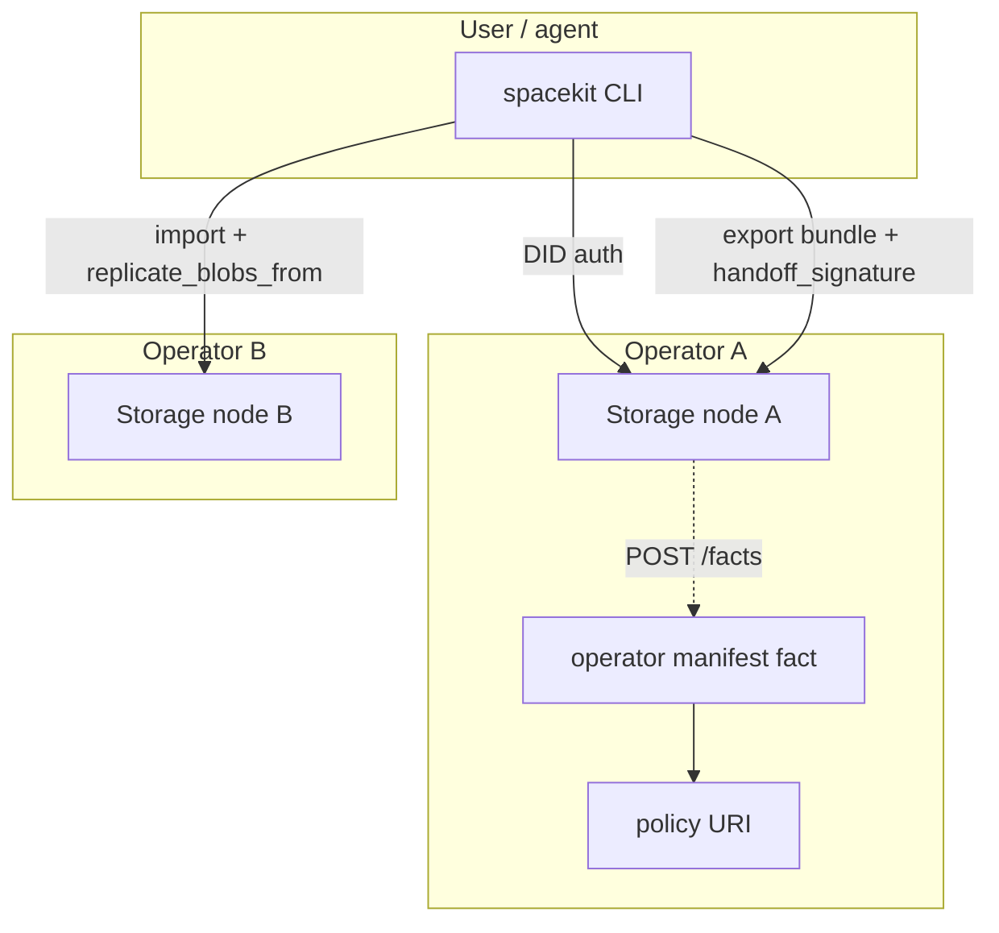

# Federation design memo (Stream E)

Canonical reference for inter-operator federation in SpaceKit storage. Locks scope,
trust model, wire formats, and implementation sequence against what is **already
shipped** in the storage node.

**Status:** Preview / active implementation (2026). Not a final network standard.

---

## Answers to the three scoping questions

### 1. Where are we in the federation work?

| Phase | State |
|-------|--------|
| **Design** | This memo + [`federation-roadmap.md`](./federation-roadmap.md) |
| **Implementation** | Handoff, blob replication, HMAC `handoff_signature`, DID migration v2, `spacekit:operator:v1`, `GET /api/operators/self` |
| **Testing** | `hybrid_auth_soak` / `strict_auth_soak`; multi-node handoff is manual CLI |
| **Partner onboarding** | [`operator-abuse-policy.md`](./operator-abuse-policy.md) template only |

**Workspace migration (item 2)** is shipped with layered auth (HMAC + optional DID v2).
**Discovery (item 1)** is shipped for pull-based manifest/self; network index is not started.
**Collaboration (item 3)** and search/settlement (items 4–5) are not started.

### 2. What federation scope are we targeting?

**Primary: (c) Workspace-level federation.** The workspace is the portability unit:
export bundle, import, optional CAS replication, collaborator list on
`WorkspaceContent`. Operators are hosting layers; users move workspaces between them.

**Secondary: (a) Inter-operator federation.** Operators publish manifests and accept
handoffs from peers that meet auth + policy bar. No network-wide index yet — discovery
is pull-from-known-URL or future gossip.

**Deferred: (b) Cross-organization federation as a separate model.** In practice this
is a deployment pattern of (a)+(c): two orgs run nodes and exchange workspace bundles.
We do not build a distinct ActivityPub-style social graph in v1.

### 3. What is the trust model?

Layered — not a single “trust the operator” switch:

| Layer | Mechanism | Today |
|-------|-----------|--------|
| **Facts & commits** | SPHINCS+ on `FactPackage` (strict mode) | Strict optional; hybrid = DID match only on POST |
| **HTTP agentic API** | `Authorization: DID` + rate limits | Shipped |
| **Blob/fact HTTP** | Configurable `permissive` / `hybrid` / `strict` | Hybrid soak-validated on your node |
| **Cross-node handoff** | HMAC `handoff_signature` on export bundle | Shipped (`handoff.rs`) |
| **Migration attestations** | SPHINCS+ on `migration_manifest` (v2) | Shipped (`migration.rs`) |
| **Operator policy** | Signed policy URI in operator manifest | Stream D — document only |
| **Operator reputation** | Federated scores | Not started |

**Target for production federation:** **verified trust** at the operator boundary
(policy URI, manifest fact, auth mode declared) plus **cryptographic trust** for
user data (facts, commits). Reputation augments discovery later; it does not replace
signatures.

---

## What the hybrid soak actually proved (nuance)

Your soak results are valid for **Stream A staging**. One precision:

- **`PUT /blobs` with `Authorization: DID`** — hybrid checks that a DID header (or
  upload token) is present. It does **not** verify a SPHINCS+ signature on the HTTP
  request body for blobs.
- **`POST /facts` with matching DID** — hybrid requires auth and author match; empty
  signatures are allowed until **strict** mode.
- **SPHINCS+ on facts** — enforced in **strict** mode only (`strict_auth_soak` uses an
  ephemeral signed fact).

So: hybrid = **authenticated writes**, asymmetric blob reads. Strict = **signed facts**
+ authenticated blob reads.

---

## Architecture (v1)

### Wire artifacts (shipped or specified)

| Artifact | Schema / path | Purpose |
|----------|---------------|---------|
| Workspace export | `spacekit:workspace:v1` bundle | Migration payload |
| Handoff MAC | `handoff_signature` field | Layer 1: operator-shared secret attestation |
| Migration manifest | `migration_manifest` on bundle | Layer 2: DID-bound migration record |
| Migration audit fact | `spacekit:migration_record:v1` | Post-import persistence on destination |
| Operator manifest | `spacekit:operator:v1` fact | Discovery: URL, auth mode, policy, migration versions |
| Blob replication | `POST /api/blobs/replicate` | CAS fill on destination |

### Not in v1

- Network-wide operator index (gossip or central directory)
- Live cross-operator sandbox journal sync
- Workspace owner counter-sign (wallet UI)
- Federated search
- SpaceKit Pay settlement between operators

---

## Stream E work items — order of execution

Aligned with ENHANCEMENTS.md §3.5, resequenced by what dependencies allow:

1. **Workspace migration** — **shipped.** Export/import/replicate; HMAC handoff + DID v2
   manifests; CLI `workspace export/import`, `migration verify/sign`. Next: owner
   counter-sign, production `SPACEKIT_REQUIRE_MIGRATION_ATTESTATION` for untrusted peers.

2. **Operator discovery** — **shipped (pull model).** `operator_manifest.rs`, `GET /api/operators/self`,
   `spacekit operator publish/show`. Next: curated index or P2P gossip.

3. **Cross-operator collaboration** — **not started.** Collaborators on
   `WorkspaceContent` exist; routing writes to two nodes is future work. Conflict
   resolution stays at FactPackage / sandbox commit layer.

4. **Federated search** — **not started.** Privacy-preserving query fragments are
   spec-only.

5. **Economic settlement** — **not started.** Depends on SpaceKit Pay; out of scope
   for storage-node-only milestone.

---

## Security model (summary)

See [`federation-testing.md`](./federation-testing.md) for test scenarios.

**Defended (with correct operator config):**

- Anonymous blob upload (hybrid/strict)
- Fact author spoofing (401/403)
- Unsigned or tampered handoff bundles (when `SPACEKIT_REQUIRE_HANDOFF_SIGNATURE`)
- Scoped upload token misuse (wrong blob hash)

**Not defended (v1):**

- Malicious operator reads all data they host (hosting trust)
- Operator policy violations without external enforcement
- MITM between operators without TLS + pinned manifests
- Federated search privacy leaks (feature absent)

Communicate hosting trust clearly in Stream D policy documents.

---

## Phase 2 prerequisite checklist (revised)

| Item | Status |
|------|--------|
| Blob/fact auth (Stream A) | Done; hybrid soak passed |
| Upload tokens (Stream A item 4) | Done; soak passed |
| Workspace HTTP + CLI | Done |
| RoleBased / Conditional policy | Partial (`access_policy.rs`) |
| Strict production cutover | Next: `strict_auth_soak` on your node |
| Federation migration (HMAC + DID v2) | Done |
| Operator policy + manifest | Docs + schema; CLI publish shipped |

---

## Related documents

- [`federation-roadmap.md`](./federation-roadmap.md) — timeline
- [`federation-workspace-handoff.md`](./federation-workspace-handoff.md) — operator runbook
- [`federation-testing.md`](./federation-testing.md) — test matrix
- [`operator-abuse-policy.md`](./operator-abuse-policy.md) — Stream D
- [`operator-discovery.md`](./operator-discovery.md) — manifest schema
- [`did-signed-migration.md`](./did-signed-migration.md) — layer 2 migration runbook
- [`blob-fact-auth-staging.md`](./blob-fact-auth-staging.md) — auth rollout
