# Federation roadmap (Stream E)

Engineering timeline after Phase 1 gaps (A/B/C), auth staging, and workspace handoff.

## Shipped (preview)

| Capability | Location |
|------------|----------|
| Workspace export/import | `GET /api/workspaces/{id}/export`, `POST /api/workspaces/import` |
| Blob hash manifest + replication | `referenced_blob_hashes`, `POST /api/blobs/replicate` |
| HMAC handoff signature | `src/handoff.rs`, `handoff_signature` on export bundle |
| DID-signed migration (v2) | `src/migration.rs`, `migration_manifest` on bundle, `spacekit:migration_record:v1` |
| Operator manifest schema | `src/operator_manifest.rs`, `spacekit:operator:v1` |
| Operator self discovery | `GET /api/operators/self`, `spacekit operator show` |
| CLI | `workspace export/import`, `operator publish`, `migration verify` / `migration sign` |
| MCP tools | `workspace_export/import`, `blobs_replicate` |

## In progress / next

| Item | Stream | Status |
|------|--------|--------|
| Strict auth cutover | A | `strict_auth_soak` example + staging guide §4 |
| Hybrid production soak | A | Operator-run (`hybrid_auth_soak` passed) |
| Operator policy templates | D | [`operator-abuse-policy.md`](./operator-abuse-policy.md) |
| Workspace owner migration counter-sign | E | Wallet/UI flow (spec in [`DID-MIGRATION.md`](../DID-MIGRATION.md) §4.2) |
| Federation v1↔v2 matrix CI | E | Manual matrix in [`federation-testing.md`](./federation-testing.md) |
| Network-wide operator index | E | Not started |
| Cross-operator sandbox journals | E | Not started |
| Federated search | E | Not started |
| Operator settlement (SpaceKit Pay) | E | Not started |

## Recommended operator sequence

```mermaid
flowchart LR
  permissive[permissive default]
  hybrid[hybrid soak]
  strict[strict soak]
  handoff[signed handoff]
  policy[publish operator policy]
  manifest[publish operator manifest]
  didmig[DID migration v2]
  federate[multi-operator handoff]

  permissive --> hybrid
  hybrid --> strict
  strict --> handoff
  handoff --> policy
  policy --> manifest
  manifest --> didmig
  didmig --> federate
```

1. **Hybrid** — `blob_fact_auth = "hybrid"` + `hybrid_auth_soak`.
2. **Strict** — `blob_fact_auth = "strict"` + `strict_auth_soak`.
3. **Handoff** — shared `SPACEKIT_HANDOFF_SECRET` on source/destination.
4. **Policy** — publish `content_policy_uri` (Stream D).
5. **Manifest** — `spacekit operator publish` (includes `sphincs_public_key_hex` when keypair exists).
6. **DID migration** — export with v2 manifest; destination import counter-signs and stores `spacekit:migration_record:v1`.
7. **Federation** — second operator + import/replicate workflow.

## Dependencies

- Stream A auth must match on both sides for `replicate_blobs_from` (hybrid/strict).
- Stream D policy URI should be live before advertising federation membership.
- Destination must resolve source operator pubkey (published manifest, `/api/operators/self`, or pre-seeded CAS fact).
- Stream F metrics: `GET /api/agentic/health` (`migration_signing_configured`) during soak.

## Related

- [`federation-design.md`](./federation-design.md) — scope, trust, sequence
- [`federation-testing.md`](./federation-testing.md) — test matrix
- [`did-signed-migration.md`](./did-signed-migration.md) — operator runbook
- [`federation-workspace-handoff.md`](./federation-workspace-handoff.md)
- [`blob-fact-auth-staging.md`](./blob-fact-auth-staging.md)
- [`ENHANCEMENTS.md`](../../ENHANCEMENTS.md) §3.4–3.5
