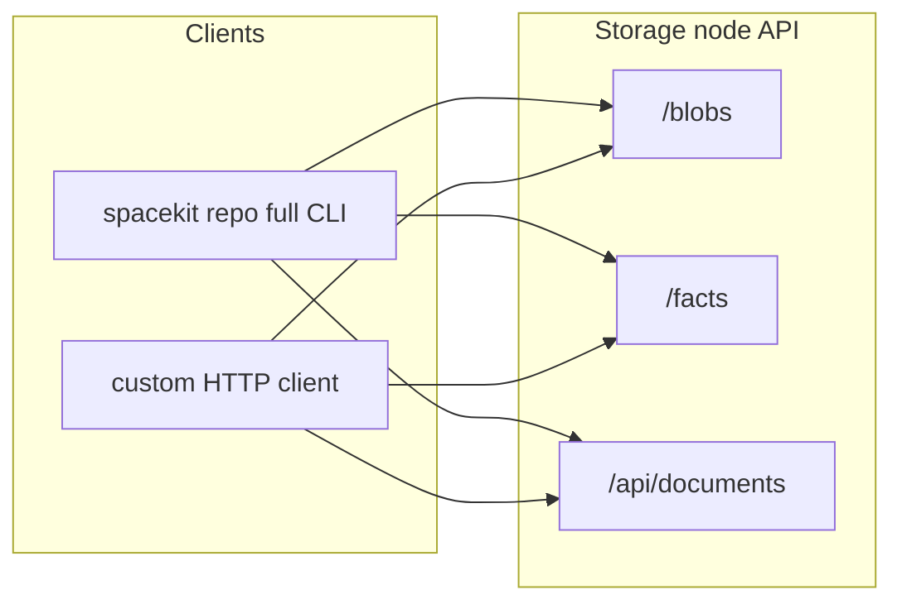

# SpaceKit repository hosting on the storage node

This guide explains how to use **`spacekit-storage-node` as the remote backend for a lightweight, Git-style repository** layered on content-addressed storage (CAS). It complements encrypted per-user file APIs (`POST /files/upload`, envelope flows) rather than replacing them.

## Mental model

| Layer | Role | HTTP surface | On-disk (relative to node `DATA_DIR`) |
|--------|------|--------------|----------------------------------------|
| **Blobs** | Immutable file bytes, deduplicated by hash | `/blobs/...` | `blobs/{2-char-prefix}/{full-hex}` |
| **Commits** | Version snapshots: path → BLAKE3, message, ancestry | `/facts` and `/facts/{id}` | `facts/{prefix}/{id}.json` |
| **Refs** | Mutable pointer to tip commit per branch | DID-scoped docs | Rows in DB (`DocumentRecord`), not blobs |

Rough flow:



Commits are **`FactPackage` JSON** whose `FactContent::Json` uses schema **`spacekit:repo:commit:v1`** (`tree`, `message`, `author_name`, `timestamp`; see crate [`spacekit-repo`](../../../spacekit-repo/) in this repo). **`dependencies`** on the package hold parent commit IDs (usually a single parent).

## Prerequisites

1. Running **Rust storage node** with `data_dir` configured (facts and blobs persist under it).
2. For **references**, a DID that the node recognizes for `Authorization` on `/api/documents/...`.
3. For the **recommended workflow**, build the **`spacekit` CLI with `full`** (includes `spacekit repo`):

```bash
cargo build -p spacekit --features full --release
```

## REST API summary

Unless noted, URLs are rooted at `https://YOUR_NODE/` (often `http://127.0.0.1:3030`). Large uploads use the same body limits as file uploads.

### Content-addressed blobs (CAS)

| Method | Path | Purpose |
|--------|------|---------|
| `PUT` | `/blobs/{hash}` | Body = raw bytes. `hash` is **64 hex chars**, **BLAKE3** of body. If object already exists, returns **200** and does not rewrite. Else **201** with JSON metadata. |
| `GET` | `/blobs/{hash}` | Returns raw octet stream (`application/octet-stream`), or JSON error body on failure. |
| `HEAD` | `/blobs/{hash}` | Existence probe; **`Content-Length`** when present. |
| `POST` | `/blobs/exists` | JSON `{"hashes":["...", ...]}` → JSON `missing` / `found` lists (see handler for exact shape). |

**Operator note:** these routes currently do **not** require DID headers—the trust boundary is **network access**. Put the API behind TLS, VPC rules, authentication proxies, or private networks for production.

### Commit facts (`FactPackage`)

| Method | Path | Purpose |
|--------|------|---------|
| `POST` | `/facts` | JSON **`FactPackage`**. Persisted once per `fact_id`; duplicate submits return ok without corrupting stored copy. Metadata may also be mirrored into the document index (`fact_index` collection). |
| `GET` | `/facts/{fact_id_hex}` | Full **`FactPackage` JSON**. |
| `POST` | `/facts/batch` | JSON `{ "fact_ids": ["...", ...] }` (bounded batch size); returns `{ "facts": [...], "missing": [...] }`. |

`/query/facts` remains available for filtered **metadata-only** discovery; CAS commits described here rely on **`GET /facts/{id}`** for full payloads.

### Branch ref document (mutable)

Refs use the **DID-scoped document store**:

- **PUT / GET:** `/api/documents/{collection}/{id}`
- Headers on **GET** and **PUT:** **`Authorization: DID <your-did>`** (same pattern as **`spacekit brain-registry publish`** in the full CLI [`full_client.rs`](../../../spacekit-cli/src/full_client.rs)).

Recommended convention used by **`spacekit repo push` / `pull`**:

| Part | Example value |
|------|----------------|
| `{collection}` | `repos/<repo_name>/refs` |
| `{id}` | `heads/<branch>` (e.g. `heads/main`) |
| JSON body (PUT) | `{ "tip": "<64-hex commit fact id>" }` |

Reads return `{ "document": { …DocumentRecord…, "data": { "tip": "..." }}}`.

## Using the bundled CLI (`spacekit repo`)

From a project directory, after **`spacekit init`** (identity in `~/.spacekit/config.toml`) and **`connections.storage`** (or `--storage-url`):

```bash
spacekit repo init --name myproject --remote http://127.0.0.1:3030
spacekit repo add                     # stage files (honors .gitignore/.spacekitignore; skips .spacekit/.git/target/node_modules)
spacekit repo status                  # staged vs unstaged, mid-merge state
spacekit repo commit -m "Checkpoint"  # SPHINCS+-signed if ~/.spacekit/did_wallet.json exists; --amend to rewrite tip
spacekit repo push [--storage-url URL] [-b|--branch NAME] [-f|--force]   # rejects non-fast-forward unless --force
spacekit repo pull [--storage-url URL] [-b|--branch NAME] [--depth N]
spacekit repo fetch [--storage-url URL] [-b NAME] [--depth N]            # download only; updates refs/remotes/origin/*
spacekit repo merge BRANCH             # 3-way merge; --continue / --abort for conflicts
spacekit repo log --limit 20 [--graph]
spacekit repo show [COMMIT]            # metadata, signature status, and patch
spacekit repo diff [--a ID --b ID] [--content] [--name-only]   # --content = line-level unified diff; detects exact renames
spacekit repo verify [COMMIT] [--all]  # fact-id integrity + signature + author binding
spacekit repo tag [NAME [COMMIT]] [-d NAME]
spacekit repo reset [COMMIT] [--soft|--mixed|--hard]
spacekit repo restore PATH... [--staged] [--source ID]
spacekit repo revert COMMIT
spacekit repo cherry-pick COMMIT
spacekit repo reflog                   # HEAD movement history
spacekit repo gc                       # prune objects unreachable from any ref/tag
spacekit repo clone REMOTE NAME [DIR] [--depth N]
```

Objects are content-addressed and stored locally under `.spacekit/repo/objects/{commits,blobs}`, so `diff --content`, `merge`, `show`, `reset`, and `restore` work offline. Downloaded blobs and commits are re-hashed on fetch (BLAKE3 for blobs, recomputed fact-id for commits) and rejected on mismatch. Commits are signed over their deterministic fact-id with the wallet's SPHINCS+ key; `verify` also checks that the signing key's address matches the author DID. Executable file modes are tracked; `git`-style hooks under `.spacekit/repo/hooks/{pre-commit,post-commit,pre-push}` run when executable.

### Local branches

Branches are **local refs** under `.spacekit/repo/refs/heads/<name>`. **`push` / `pull`** target **`HEAD` by default**; pass **`-b` / `--branch NAME`** for a named ref (remote document id **`heads/<NAME>`**, same convention as above).

When **`pull -b`** updates a branch you are **not** checked out on, commits and blobs are still stored locally and the tip ref file is rewritten, but **`index.json` and the working tree stay unchanged** (use **`spacekit repo checkout`** to materialize).

**`push -b`** requires that the local **`refs/heads/NAME`** file already exists (create with **`spacekit repo branch NAME`**) and that the branch tip is non-empty.

```bash
spacekit repo branch                  # list branches (`*` = current HEAD)
spacekit repo branch feature-x        # create branch at current tip
spacekit repo branch --delete old-tmp # or: -d old-tmp (not while checked out)
spacekit repo checkout feature-x [--storage-url URL]
spacekit repo pull -b feature-x
spacekit repo push -b feature-x [--storage-url URL]
```

`checkout` updates `HEAD`, `index.json`, and the working tree from CAS when file hashes differ (skipped when on-disk bytes already match the BLAKE3 in the commit). If the tip commit is missing locally, facts are fetched from `--storage-url` / config before blobs are pulled.

Local state lives under **`.spacekit/repo/`**: `HEAD`, `index.json`, `refs/heads/*`, `refs/tags/*`, `refs/remotes/origin/*`, `logs/HEAD` (reflog), `MERGE_HEAD`/`MERGE_MSG` (during a merge), `objects/commits/*/…json`, `objects/blobs/*/…`, plus `config.json` (`name`, `remote_url`, etc.).

**Notes / limitations:** `pull` is still fast-forward only — divergent branches must be reconciled with `spacekit repo merge` (which handles multi-parent histories). Rename detection is **exact** (content-identical) only; similarity-based rename detection is not implemented. Symlinks are tracked as regular files. The non-fast-forward push guard is **client-side** (it fetches the remote tip and checks ancestry); it is not yet a server-side atomic compare-and-swap, so concurrent pushers should coordinate. Delta/packfile compression is not implemented (objects are stored and transferred whole).

## Custom clients (without the CLI)

1. BLAKE3 hash each file; **`PUT /blobs/{hex}`** for each unique hash (use **`POST /blobs/exists`** to skip uploads).
2. Build **`FactPackage`** JSON for commits (reuse logic from **`spacekit-repo`** or mirror its field layout): `content.schema = spacekit:repo:commit:v1`, `dependencies` = parent `[u8;32]` IDs.
3. **`POST /facts`** each new commit starting from genesis (oldest-first if you replay a chain).
4. **`PUT /api/documents/repos/<name>/refs/heads/<branch>`** with **`Authorization`** and `{ "tip": "…" }`.

## Encryption and privacy

- **CAS blobs and stored commit JSON are not envelope-encrypted** by these endpoints; anyone who can read your network can fetch known hashes and fact IDs unless you isolate the node.
- For **subscriber-only payloads**, continue to use **`/files/...`** (KEM envelopes) and entitlement flows (`/files/{file_id}/rewrap`, entitlement ledger)—then store ** ciphertext IDs or manifests** inside repo commits rather than raw `/blobs` secrets.

## Troubleshooting

| Symptom | Check |
|--------|--------|
| `503` on blob/fact APIs | Storage node started without **`data_dir`** (file-backed API not configured). |
| `400` blob hash mismatch | Client path hash must equal **BLAKE3** of PUT body (**lowercase hex, 64 chars**). |
| `404` on ref GET | DID in `Authorization` must match **`owner_did`** used when creating the doc; collection/id must encode branch path exactly (`repos/<repo>/refs` + `heads/main`). |

## See also

- [`spacekit-repo`](../../../spacekit-repo/) — shared types and deterministic commit `fact_id`.
- [`spacekit-diff`](../../../spacekit-diff/) — offline tree merge/diff primitives.
- [Brain registry and storage sync](../../../spacekit-js/docs/BRAIN_REGISTRY_AND_STORAGE_SYNC.md) — same document PUT pattern.
